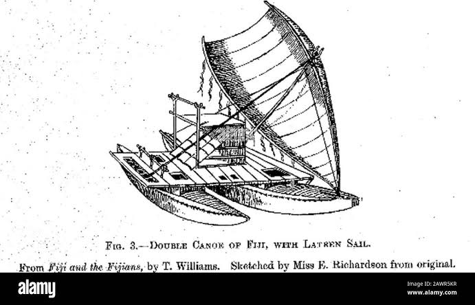
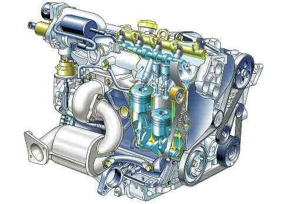
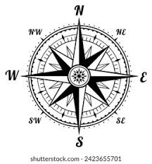

<!DOCTYPE html>
<html>
    <head>
         <meta charset="utf-8">
         <meta name="autor" content="Jhean Barranzuela">
         <meta name="description" content="Estructuras de una Embarcacion">
         <meta name="keywords" content="Estructuras de una Embarcacion">
         <title>Embarcaciones Nauticas</title>
         <link rel="icon" type="image/x-icon" href="dist/image/brujula.jpg">
    </head>
    <body bgcolor="99F2C5">
        <!--Encabezado de nuestra pagina web-->
        <header>    
            <table width="100%" bgcolor= "A7AB96">
                <tr>
                    <!--para el logo-->
                    <td width="10%" align="center">
                            
                    </td>    
                    <!--titulo-->
                    <td width="30%">
                        Embarcaciones Nauticas
                    </td>
                    <td width="60%">
                        <!---Menu--->
                        <nav align="right">
                             <a href="index.html">
                                 <button>🦈 Inicio</button>
                             </a>
                             <a href="page/acercade.html">
                                 <button>🐳 Acerca de</button>
                             </a>
                             <a href="#SECTION_VIDEO">
                                <button>🐬Mas Info</button>
                             </a>
                        </nav>
                    </td>    
                </tr>
            </table>
        </header>
        <!--contenido principal-->
        <main>
            <!--APARTADO BANNER-->
            

            <section>
                <tabla width="100%">
                    <tr>
                        <td width="5%"></td>
                        <td width="50%" align="left">
                            <h1> 
                                E.N, Embarcaciones Nauticas
                            </h1>
                            

                                Aqui vemos varios tipos de embarcaciones ya que varia en modelos, diseños y tamaños
                            

                        </td>
                        <td width="5%"></td>    
                        <td width="40%">
                            
                        </td>    
                    </tr>
            </section>
            

            <!--APARTADO DE CURSO-->
            <section>
                <h1 align="center">Funcionalidades</h1>
                <table width-"100%" cellspacing-"15px">
                    <tr>
                        <td width="5%"></td>

                        <td width="15%" bgcolor="#C2C74C">
                            <figure>
                                
                                <figcaption align="center">
                                    <h3>Motor Nautico</h3>
                                    
Marcas de Motores

                                    <a herf="#"><button>ver mas</button></a>
                                </figcaption>
                            </figure>
                        </td>
                        <td width="15%" bgcolor="#C2C74C">
                            <figure>
                                
                                <figcaption align="center">
                                    <h3>navegacion nautica</h3>
                                    
resalta la habilidad del navegante

                                    <a herf="#"><button>ver mas</button></a>
                                </figcaption>
                            </figure>
                        </td>
                        <td width="15%" bgcolor="#C2C74C">
                            <figure>
                                
                                <figcaption align="center">
                                    <h3>isntrumentos de navegacion</h3>
                                    
Es necesario usar radios, brujulas, radar ,etc

                                    <a herf="#"><button>ver mas</button></a>
                                </figcaption>
                            </figure>
                        </td>    
                        <td width="15%" bgcolor="#C2C74C"
                            <figure>
                                
                                <figcaption align="center">
                                    <h3>carta de navegacion</h3>
                                    
Es un cartograma que nos permite seguir rutas

                                    <a herf="#"><button>ver mas</button></a>
                                </figcaption>
                            </figure>
                        </td>
                        <td width="5%"></td>
                    </tr>
                </table>
            </section>

            <!--APARTADO DE VIDEOS Y MAPAS-->
            

            <setion id="SECTION_VIDEO">
                <h1 align="center">MAS INFO</h1>
                <table width="100%" cellspacing="15px">
                    <tr>
                        <td width="5%"></td>
                        <td width="30%" bgcolor="#ffffff">
                            <figure>
                                <iframe width="100%"
                                src="https://www.youtube.com/embed/sStbI_yuJqo?si=hnA6mTx76I2XfiK1" title="YouTube video player" frameborder="0" allow="accelerometer; autoplay; clipboard-write; encrypted-media; gyroscope; picture-in-picture; web-share" referrerpolicy="strict-origin-when-cross-origin" allowfullscreen>
                            </iframe>
                            <figcaption align="center>"
                                <h3>EMBARCACION</h3>
                                
Embarcaciones Militares

                                <a href="https://www.youtube.com/watch?v=sStbI_yuJqo" target="blank"><button>ver mas</button></a>
                            <figcaption>
                            </figure>
                        </td>
                        <td width="30%">
                            <figure>
                                <iframe src="https://www.google.com/maps/embed?pb=!1m18!1m12!1m3!1d15623.442162493047!2d-77.19252437353134!3d-11.774868610249737!2m3!1f0!2f0!3f0!3m2!1i1024!2i768!4f13.1!3m3!1m2!1s0x91067ff9ef821697%3A0xe9e0a9cfa9c29cba!2sYacht%20Club%20Ancon!5e0!3m2!1ses-419!2spe!4v1758103732798!5m2!1ses-419!2spe" width="100%" allowfullscreen="" loading="lazy" referrerpolicy="no-referrer-when-downgrade"><button>ver mas</button>
                                </iframe>
                                <h3>Ubicacion</h3>
                                
YACTH CLUB

                                <a href="https://maps.app.goo.gl/5kuayQHeEiAsnuch8"><button>ver mas</button>
                                </iframe>"                   
                            </figure>
                        </td>
                        <td width="30%"></td>

                        <td width="5%"></td>
                    </tr>
                </table>
            </setion>
            <!--APARTADO LISTAS DESPLEGLABLES-->
            

            <h1 aling="center">PREGUNTAS FRECUENTES</h1>
            <seccion id="SECCION_LISTADO">
                <table width="100%" cellspacing="15px">
                    <tr>
                        <td width="5%"></td>
                        <td width="40%" bgcolor="#D7F2BF">
                             
                            

                                <sumary>
                                    ¿Que es una Embarcacion Nautica?
                                </sumary>
                                
Es un vehiculo capaz de navegar por el agua propulsado por remo,vela o motor.

                                <h4>¿Que modelos existen?</h4>
                                <ol>
                                    <li>VELEROS</li>
                                    <li>YATES</li>
                                    <li>CATAMARANES</li>
                                    <li>LANCHAS</li>
                                </ol>
                                <h4>TEMAS</h4>
                                <ol>
                                    <li>ESTRUCTURAS</li>
                                    <li>DISEÑOS</li>
                                    <li>PRECIOS</li>
                                </ol>
                            

                             
                        <td width="40%"></td>
                        <td width="5%" ></td>
                    </tr>
                </table>
            </seccion>
        </main>
        <!--pie de pagina-->
        <footer>
        </footer>
    </body>
</html>
